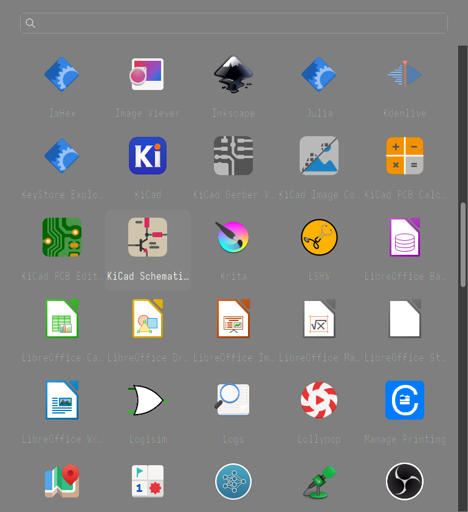
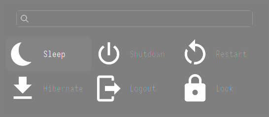
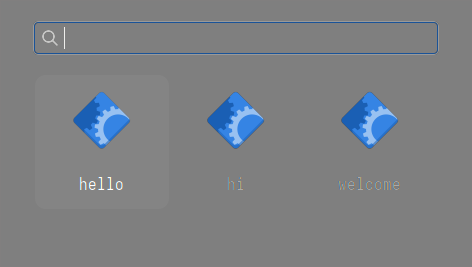
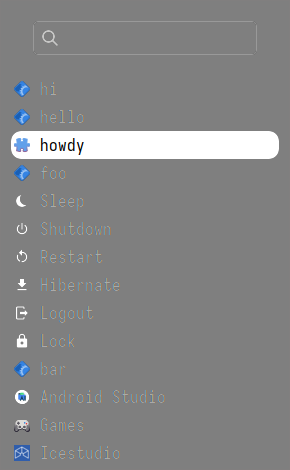

* GMenu
Yet another dmenu-like utility

** Why?
I used to be that person who refuses to use anything but the original dmenu, with bunch of patches of course.
[[https://github.com/Naheel-Azawy/dmenu][My fork of dmenu]] had lots of changes and even included icons, which I haven't seen anyone attempting to implement.
But then, I had to face it. It's just impractical to write GUI with Xlib alone.
Another reason is that I wanted something that works with touch screens. GTK handles that by default.

GTK is used here because I don't like Qt. Should it be GTK4? Maybe someday.
Vala is used because I'm in rush but I didn't want it to be too crappy

** Installation
#+begin_src shell
  sudo make install
#+end_src

** Usage and screenshots
Try ~gmenu --help~ for more.

#+begin_src shell-script
  gmenu apps
#+end_src

#+begin_src shell-script
  gmenu power
#+end_src

#+begin_src shell-script
  printf 'hello\nhi\nwelcome\n' | gmenu
#+end_src

#+begin_src shell-script
  {
      echo hi
      echo hello
      echo howdy :: icon=application-x-addon
      echo foo
      echo :: cmd=power
      echo bar
      echo :: cmd=desktops dirs="$HOME/.local/share/applications"
      echo :: cmd=set maxcols=3
  } | gmenu --list -d 15%x39% -i 16 -sf black -sb white -n 2
#+end_src

Each line is plain text by default; ~text :: key=value key2=value2~ decorates
it (~name~, ~exec~, ~icon~, ~icon-size~, ~comment~, ~selected~, ~terminal~,
~confirm~, ~id~, ~where~), and ~cmd~ is a directive instead of an item
(~power~, ~desktops~, ~json-file~, ~set~ -- the last one changes an option,
e.g. ~index~, mid-session; ~delete~, ~delete-all~ -- see below). A value can
contain spaces without quoting -- e.g. an unquoted file path from a script
that didn't think to quote it still reads correctly, as long as no later
word in it happens to look exactly like ~word=~; quoting is only needed to
disambiguate a value against that. Quotes here are just normal shell
quoting, so plain ~echo~/~printf~ without an outer wrapping quote works
fine, as above, with no spacing rules to remember: ~::~ is never special to
any POSIX shell, so unlike some other marker characters (brackets,
redirection operators, ...) it never needs quoting just to survive being
echoed. See ~gmenu --help~ for the full syntax.

A later item with the same ~id~ as one already shown replaces it in place,
instead of adding a new one -- for a value that changes over time:

#+begin_src shell-script
  {
      i=0
      while true; do
          i=$((i + 1))
          echo "Count: $i :: id=counter"
          sleep 1
      done
  } | gmenu --stay
#+end_src

An item can also be removed outright instead of replaced: ~:: cmd=delete
id=<STR>~ removes just the one with that id, ~:: cmd=delete-all~ removes
everything. Either way, an id that doesn't match anything is a silent
no-op, not an error.

~where=toolbar~ places an item as a plain button next to the search box,
instead of in the normal, filtered, navigable list -- for a handful of
actions you always want at a glance rather than mixed in with what you're
searching through. It's still just an item: ~id~-based replace and delete
work on a toolbar item exactly like they do on a content one.

#+begin_src shell-script
  {
      echo Alpha
      echo Bravo
      echo Refresh :: where=toolbar icon=view-refresh
      echo Settings :: where=toolbar
  } | gmenu
#+end_src

Each toolbar item gets an automatic, collision-avoiding Alt+letter mnemonic
(hold Alt to see which letter), and F10 moves keyboard focus to the first
one -- Tab/Space/Enter from there reach the rest, no mouse required. Beyond
~--maxtoolbar~ items (3 by default), the rest collect behind an icon-only
"More" button's menu instead of crowding the row, icons and all.

~--multi~ turns on multi-selection: space toggles whichever item currently
has keyboard focus, ctrl-a toggles selecting everything currently shown
(respecting an active search filter), and a "Done" button (its text set
with ~--done~) next to the search box finishes and prints one selected item
per line, same as pressing enter does. Clicking, ctrl-clicking, and
shift-clicking behave the way they would in a file manager.

#+begin_src shell-script
  printf 'Alpha\nBravo\nCharlie\n' | gmenu --multi
#+end_src

Finally, ~--noparse~ turns all of the above off: every stdin line is pushed
as plain text, including one that would otherwise be a directive or
contain ~::~ -- and unlike the default, a line that's just "END" is no
longer special either, so only actually closing stdin ends input.

The older ~>>word arg~ syntax below still works but is *deprecated*; prefer
the one above in new scripts.

#+begin_src shell-script
  {
      echo hi
      echo hello
      echo '>>j {"name":"howdy","icon":"application-x-addon"}'
      echo foo
      echo '>>power'
      echo bar
      echo '>>desktops ~/.local/share/applications'
  } | gmenu --list -d 15%x39% -i 16 -sf black -sb white -n 2
#+end_src

** Related links
- [[https://tools.suckless.org/dmenu/][dmenu]]
- [[https://github.com/Naheel-Azawy/dmenu][dmenu - personal fork]]
- [[https://github.com/nwg-piotr/sgtk-menu][sgtk-menu]]
- [[https://github.com/nwg-piotr/nwg-drawer][nwg-drawer]]

** License
GPL3
